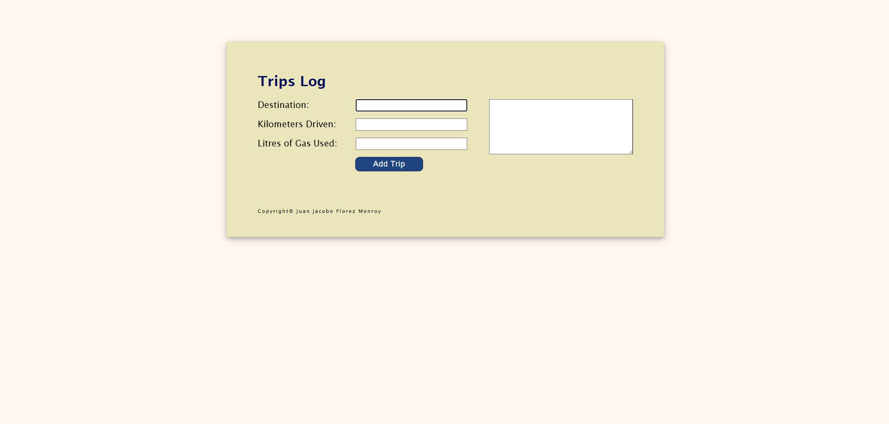

# 🚗 Trips Log

## 📌 Project Overview

**Trips Log** is a **web application** that helps users **log their trips** by entering **destination details, kilometers driven, and liters of gas used**. It calculates the **fuel efficiency** (kilometers per liter - KML) for each trip and displays the **cumulative KML** for all logged trips. This application is ideal for **tracking fuel consumption** and optimizing travel efficiency.

Developed as part of a **college assignment**, this project showcases **JavaScript-based data management, dynamic UI updates, and object-oriented programming (OOP) principles**.

---

## 🚀 Features

- 📝 **Log Trips** – Users can add trip details, including **destination, kilometers driven, and liters of gas used**.
- 🔢 **Fuel Efficiency Calculation** – Automatically calculates the **KML** for individual trips.
- 📊 **Cumulative KML** – Displays the **average KML** across all logged trips.
- 🖥️ **Interactive User Interface** – Provides a **real-time trip list** that updates as new trips are added.
- ✅ **Input Validation** – Ensures **all fields** are completed with **valid data** before adding a trip.

---

## 🛠 Technologies Used

- **HTML5** → Structures the user interface.
- **CSS3** → Styles the layout with a **clean and accessible design**.
- **JavaScript (ES6)** → Handles **dynamic interactions, input validation, and trip data calculations**.
- **jQuery** → Simplifies **DOM manipulation** and event handling.
- **Object-Oriented Programming (OOP)** → Implements a `Trip` class and `trips` module for structured data management and calculations.

---

## 🎯 Project Purpose

This project was developed as part of a **college assignment**, allowing me to practice:

- ✅ **JavaScript object-oriented programming** for managing trip data.
- ✅ **Data validation and error handling** for better user experience.
- ✅ **Dynamic DOM manipulation** for updating trip logs in real time.
- ✅ **Modular programming principles** to maintain clean and reusable code.
- ✅ **User experience (UX) improvements** for smooth navigation and interaction.

---

## 📂 Project Structure

```
📁 trips_log
 ├── 📄 index.html        # Main HTML file for the application
 ├── 📄 trips.css         # Stylesheet for the layout and design
 ├── 📄 trips.js          # Handles user interactions and DOM updates
 ├── 📄 lib_trips.js      # Contains the Trip class and trip data module
```

---

## 🏃‍♂️ How to Use the Application

1️⃣ **Open the Application** – Launch `index.html` in a modern web browser.
2️⃣ **Enter Trip Details** – Input:
   - **Destination** – Enter the trip's location.
   - **Kilometers Driven** – Input total kilometers driven (**must be a positive number**).
   - **Liters of Gas Used** – Input fuel consumption (**must be a positive number**).
3️⃣ **Add Trip** – Click **"Add Trip"** to log the trip.
4️⃣ **View and Manage Trips** – See all logged trips along with **individual and cumulative KML** in the trip log.

---

## 📝 Code Highlights

### **`Trip` Class** (`lib_trips.js`)
- Stores **trip details** and **calculates KML**.
- Validates **input data** to ensure correctness.

### **`trips` Module** (`lib_trips.js`)
- Manages **trip data**, calculates **cumulative KML**, and formats trip details for display.

### **Dynamic Event Handling** (`trips.js`)
- Captures **user input** and **updates the trip log dynamically**.

---

## 🌟 Future Improvements

- ✏️ **Edit/Delete Trips** – Add functionality to modify or remove specific trips.
- 💾 **Persistent Storage** – Save trip data using **local storage** or a **database**.
- 🔍 **Advanced Filters** – Enable **sorting and filtering** trips by **destination or KML**.
- 🎨 **Enhanced UI** – Incorporate **animations and themes** for a better user experience.

---

## 🎭 Screenshots  

| Trips Log Application |  
|--------------|  
|  |  

---

## 📜 License

This project was developed for **educational purposes** as part of a **college assignment**.

---

## 💼 Author

👤 **Juan Jacobo Florez Monroy**  
🌐 **Portfolio**: [jjacobo95.com](https://jjacobo95.com)  
🐙 **GitHub**: [github.com/jjacoboflorez95](https://github.com/jjacoboflorez95)